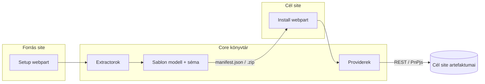
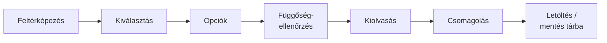
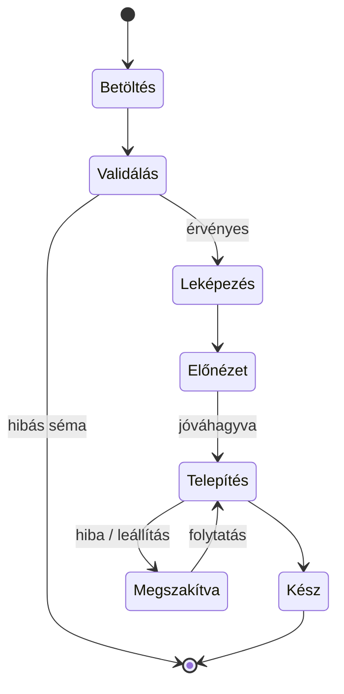

# CopyJet – SPFx site-reprodukáló megoldás rendszerterve

Utolsó frissítés: 2026-09-24 · Szerző: Zoli · Élő változat: https://claude.ai/code/artifact/63d56de8-f2b4-4480-b4f2-8e9c39af6b88

## 1. Áttekintés

A CopyJet két SPFx webpartból álló megoldás, amely egy SharePoint Online site egészét vagy kiválasztott részeit (listák, tárak, SharePoint-csoportok, modern lapok, navigáció) egy hordozható sablonfájlba menti, majd egy másik site-on abból újra létrehozza. A mentés opcionálisan a tartalmat (listaelemek, fájlok) is tartalmazza.

**Célok**

- Kódolás és PowerShell nélküli, böngészőből futtatható site-reprodukció site-tulajdonosoknak.
- Szelektív másolás: egész site vagy tetszőleges részhalmaz.
- Csak szerkezet vagy szerkezet + tartalom.
- Megismételhető, naplózott, hiba után folytatható telepítés.

**Fogalmak**

| Fogalom | Jelentés |
| --- | --- |
| Forrás site | Ahonnan a Setup webpart kiolvassa a szerkezetet |
| Cél site | Már létező site, ahová az Install webpart telepít |
| Sablon (template) | A Setup kimenete: `manifest.json`, tartalommásolásnál fájlokkal együtt egy `.zip` csomag |
| Artefaktum | A sablon egy eleme: mező, tartalomtípus, lista, tár, nézet, csoport, elem, fájl, lap, navigáció |
| Telepítési terv | Az Install által a sablonból képzett, függőség szerint rendezett lépéssor |

## 2. Hatókör és követelmények

Az 1. verzió SharePoint Online-ra készül, azonos tenanton belüli és tenantok közötti másolásra egyaránt: a sablon önálló, hordozható JSON (tartalommal `.zip`), telepítéskor nem kell elérni a forrás site-ot. A cél site előre létezik; a site létrehozása későbbi fejlesztés.

**Funkcionális követelmények**

| ID | Követelmény | Webpart |
| --- | --- | --- |
| F1 | A forrás site artefaktumainak fastruktúrás listázása, jelölőnégyzetes kiválasztással | Setup |
| F2 | „Teljes site” gyorsválasztás | Setup |
| F3 | Listánként / táranként: csak szerkezet vagy szerkezet + tartalom | Setup |
| F4 | SharePoint-csoportok másolása, opcionálisan tagokkal (alapértelmezetten kikapcsolva) | Setup |
| F5 | Függőségek (lookup céllista, site column, tartalomtípus, lapon használt lista és kép) automatikus bevonása | Setup |
| F6 | Sablon letöltése és/vagy mentése a forrás site egy dokumentumtárába | Setup |
| F7 | Modern lapok másolása szakaszokkal és webpartokkal | Setup + Install |
| F8 | Navigáció másolása (bal oldali és felső menü) | Setup + Install |
| F9 | Fájlok verzióelőzményeinek másolása opcionálisan (alapértelmezetten kikapcsolva) | Setup + Install |
| F10 | Sablon beolvasása feltöltéssel vagy dokumentumtárból / URL-ről | Install |
| F11 | Séma- és verzióvalidálás, előnézet (mi jön létre, mi ütközik) | Install |
| F12 | Ütközéskezelési mód: kihagy / frissít / átnevez | Install |
| F13 | Felhasználó- és term-leképezés tenantok közötti telepítéshez | Install |
| F14 | Telepítés függőségi sorrendben, élő folyamatjelzővel | Install |
| F15 | Telepítési napló mentése, hiba után folytatás | Install |

**Nem funkcionális követelmények**

- **Technológia:** SPFx 1.23.2 (Heft build, Node 22), React 17.0.1, Fluent UI, PnPjs 4.21.0, opcionálisan @pnp/graph; nincs külső backend.
- **Jogosultság:** a felhasználó saját (delegated) jogaival fut; nincs szükség tenant-szintű API-engedélyre.
- **Telepítés:** az app site-onként kerül hozzáadásra (`skipFeatureDeployment: false`), a forrás és a cél site-on is.
- **Teljesítmény:** batch-elt REST hívások, throttling (429/503) kezelése `Retry-After` alapján.
- **Méretezés:** tipikus site 20–30 lista/tár, egyenként 30–50 elem vagy dokumentum, összesen 1–200 MB. Tervezési felső határ: 100 lista, 5000 elem/lista, 1 GB – ez böngészőből, háttérszolgáltatás nélkül kezelhető.
- **Nyelv:** magyar és angol felület; a sablon nyelvfüggetlen belső neveket használ.

**Nem cél az 1. verzióban:** új site létrehozása (későbbi fejlesztés), hub-navigáció, klasszikus (wiki / webpart) lapok, Power Automate folyamatok, egyedi elem-szintű jogosultságok.

## 3. Architektúra

Egy SPFx solution (`copyjet.sppkg`) két webpartot és egy közös core könyvtárat tartalmaz; mindkét webpart ugyanazt a sémát és modellt használja, így a kiolvasás és a telepítés nem térhet el egymástól.

A Setup az extractorokkal olvas, a modellből sablont készít; az Install a sablonból tervet képez, és a providerekkel hozza létre az artefaktumokat.

| Réteg | Modul | Feladat |
| --- | --- | --- |
| UI | `SetupWebPart` | Artefaktumfa, opciók, export indítása |
| UI | `InstallWebPart` | Sablon betöltése, leképezés, előnézet, telepítés, napló |
| Core | `extractors/*` | Egy extractor artefaktumtípusonként (Fields, ContentTypes, Lists, Views, Groups, Items, Files, Pages, Navigation) |
| Core | `providers/*` | Az extractorok párjai: létrehozás / frissítés a cél site-on |
| Core | `model` + `schema` | TypeScript típusok és JSON Schema; validálás AJV-vel |
| Core | `planner` | Függőségi gráf, topologikus rendezés, lépéslista |
| Core | `tokenizer` | Site-specifikus értékek (URL, GUID, user ID) tokenekre cseréje és vissza |
| Core | `mapping` | Felhasználó-, term- és elem-ID-leképezés |
| Core | `packager` | `.zip` összeállítás és kicsomagolás (JSZip) |
| Core | `logger` + `state` | Napló, állapotmentés folytatáshoz |

**Használt API-k**

- SharePoint REST (`_api/web`, `lists`, `fields`, `contenttypes`, `sitegroups`, `$batch`) PnPjs-en keresztül.
- `SP.Utilities.WebTemplateExtensions.SiteScriptUtility.GetSiteScriptFromList` – opcionális segéd a lista-sémák kinyeréséhez.
- `Site.CreateCopyJobs` / `SP.MoveCopyUtil` – azonos tenanton belüli szerveroldali fájlmásolás (lásd 7. fejezet).
- Modern lapok: `_api/sitepages/pages` és a PnPjs `ClientsidePage` API (`CanvasContent1`); navigáció: `web.navigation.quicklaunch` és `topNavigationBar`.
- Microsoft Graph (`@pnp/graph`) csak opcionális bővítésként (felhasználó-leképezés ellenőrzése, M365 csoporttagság).

**Miért saját séma, és nem PnP Provisioning?** A PnP Framework provisioning engine .NET/PowerShell, böngészőben nem fut. A saját séma a PnP sablon fogalmait követi (tokenek, sorrend), de JSON-ban és tartalommal bővítve.

## 4. Setup webpart

A Setup a forrás site egy lapján fut, feltérképezi a site-ot, a felhasználó kiválasztja a másolandó részeket, majd a webpart elkészíti a sablont.

1. **Feltérképezés:** a webpart lekéri a listákat és tárakat (rejtett és rendszerlisták nélkül), a site columnokat, tartalomtípusokat, SharePoint-csoportokat, a modern lapokat és a navigációt, elemszámmal és mérettel.
2. **Kiválasztás:** fanézet (Site → Listák / Tárak / Csoportok / Site columnok / Tartalomtípusok / Lapok / Navigáció), „Teljes site” kapcsolóval.
3. **Opciók artefaktumonként:**
    - Lista / tár: csak szerkezet | szerkezet + tartalom; opcionális CAML/OData szűrő vagy mappakorlát; tárnál verzióelőzmények (alapértelmezetten ki).
    - Csoport: csak a csoport | csoport + jogosultsági szintek; tagok másolása külön kapcsoló, alapértelmezetten ki.
    - Lap: szakaszokkal és webpartokkal; kezdőlapként beállítás, ha a forrásban az volt.
    - Navigáció: bal oldali (Quick Launch) és/vagy felső menü.
    - Globális: szerző/módosító és dátumok megőrzése, fájlméret-limit, csomagolás (`.json` vagy `.zip`).
4. **Függőség-ellenőrzés:** ha egy kiválasztott lista lookup mezője nem kiválasztott listára mutat, egyedi tartalomtípust használ, vagy egy lap webpartja listára, képre (SiteAssets) hivatkozik, a webpart felajánlja annak bevonását.
5. **Kiolvasás:** az extractorok a modellbe írnak; a site-specifikus értékeket – a webpart-tulajdonságokban és navigációs linkekben is – a tokenizer cseréli (pl. `{site}`, `{listkey:Projektek}`).
6. **Csomagolás:** csak szerkezetnél egy `manifest.json`; tartalommal `.zip` (`manifest.json` + `items/*.json` + `files/...` + `pages/*.json`).
7. **Kimenet:** böngészős letöltés és/vagy mentés a forrás site `CopyJetTemplates` tárába.

**Webpart-tulajdonságok (property pane):** alapértelmezett sablontár, max. fájlméret, rendszerlisták megjelenítése, alapértelmezett tartalommásolási mód.

## 5. Sablon JSON séma

A `manifest.json` verziózott, JSON Schemával validált dokumentum; a listákat belső név (URL) alapján azonosítja, nem GUID alapján, így bármely site-ra telepíthető. A teljes séma: `schema/copyjet.v1.schema.json`, kitöltött minták: `schema/examples/`.

| Szakasz | Tartalom | Megjegyzés |
| --- | --- | --- |
| `meta` | Név, készítő, forrás tenant és site, nyelv, ellenőrzőösszeg | Az Install ez alapján dönt a kompatibilitásról |
| `siteFields` | Site columnok, `schemaXml`-lel | A `schemaXml` a leghatékonyabb újra-létrehozás (`createFieldAsXml`) |
| `contentTypes` | Tartalomtípusok, szülő és mezőhivatkozások | Az ID megőrzése a szülő–gyerek lánc miatt fontos |
| `lists` | Lista/tár beállítások, mezők, nézetek, mappák | `key` = sablonon belüli hivatkozási kulcs |
| `lists[].content` | Hivatkozás a külön tárolt elem/fájl adatra, verziókapcsoló | Nagy tartalom nem kerül a manifestbe |
| `groups` | SP-csoportok, tulajdonos, szerepkör, opcionális tagok | `includeMembers` alapértelmezetten `false` |
| `pages` | Modern lapok: cím, elrendezés, fejléc, szakaszok, webpartok | A lap vászna (`CanvasContent1`) külön fájlban, tokenizálva |
| `navigation` | Bal oldali és felső menü hierarchiája | Linkek tokenizálva, külső linkek változatlanul |
| `principals` | A sablonban hivatkozott felhasználók listája | Tenantok közötti leképezés alapja |
| `terms` | Hivatkozott Managed Metadata termek | Címke-útvonal szerinti leképezés alapja |

**Tokenek:** `{site}`, `{sitename}`, `{siterelative}`, `{listkey:X}` → cél lista ID, `{listurl:X}`, `{fieldid:X}`, `{viewid:X:N}`, `{groupid:X}`, `{principal:key}`, `{associatedownergroup}` / `{associatedmembergroup}` / `{associatedvisitorgroup}`, `{termset:X}`. Az Install telepítés közben oldja fel őket.

## 6. Install webpart

Az Install a cél site egy lapján beolvassa a sablont, előnézetben megmutatja a változásokat, majd függőségi sorrendben létrehozza az artefaktumokat.

1. **Betöltés:** fájlfeltöltés (`.json` / `.zip`), vagy kiválasztás egy tárból / URL-ről.
2. **Validálás:** JSON Schema (AJV), `schemaVersion` kompatibilitás, hivatkozási integritás (minden `{listkey:X}` létezik), nyelvi eltérés figyelmeztetés.
3. **Leképezés:** felhasználók és termek megfeleltetése, ha a forrás tenant eltér vagy hiány van.
4. **Előnézet (diff):** artefaktumonként: *új* / *létezik – azonos* / *létezik – eltérő*. Ütközésmód (kihagy / frissít / átnevez) globálisan vagy tételenként; tételek kikapcsolhatók.
5. **Tervkészítés:** a planner függőségi gráfot épít és topologikusan rendez.
6. **Telepítés:** lépésenkénti végrehajtás, élő folyamatjelzővel és naplóval; leállítható.
7. **Zárás:** összesítő (létrejött / kihagyva / hiba), napló letöltése vagy mentése.

**Telepítési sorrend**

| # | Lépés | Miért ebben a sorrendben |
| --- | --- | --- |
| 0 | Felhasználó- és term-leképezés jóváhagyása | Más tenantnál minden későbbi lépés erre épül |
| 1 | SharePoint-csoportok | Jogosultság- és person mező értékek hivatkozhatnak rájuk |
| 2 | Site columnok (lookup nélkül) | Tartalomtípusok és listák építenek rájuk |
| 3 | Tartalomtípusok (szülő előbb) | Az ID-lánc miatt |
| 4 | Listák és tárak üres váza | Lookup célpontoknak létezniük kell |
| 5 | Lista mezők, lookupok, tartalomtípus-hozzárendelés | Most már minden céllista-ID ismert |
| 6 | Nézetek, mappák, lista-beállítások | Mezőknek létezniük kell |
| 7 | Listajogosultságok | Csoportok és listák megvannak |
| 8 | Tartalom: előbb a lookup céllisták elemei | Az elem-ID leképezés miatt |
| 9 | Fájlok (opcionálisan verziókkal) és metaadataik | Leghosszabb lépés, külön folytatható |
| 10 | Modern lapok | A webpartok listákra, képekre, dokumentumokra hivatkoznak |
| 11 | Navigáció, kezdőlap beállítása | Linkjei listákra és lapokra mutatnak |

A ciklikus lookupok (A → B → A) miatt a lookup mezők külön lépésben készülnek, és az értékeket az elemek létrehozása után egy második kör tölti ki.

## 7. Tartalommásolás

A tartalom alapértelmezetten *beágyazva* utazik (a `.zip`-ben), így a sablon bármely tenantba hordozható. Azonos tenanton opcionális a *hivatkozásos* mód: a sablon csak a forrás URL-eket tartalmazza, a fájlokat az Install szerveroldalon másolja. A várt 1–200 MB-os méretnél a beágyazott mód gond nélkül fut böngészőben.

| Szempont | Beágyazott (alapértelmezett) | Hivatkozásos (opcionális) |
| --- | --- | --- |
| Használat | Bármely cél, másik tenant, archiválás | Csak azonos tenant |
| Fájlmásolás | Letöltés → zip → chunked feltöltés | `Site.CreateCopyJobs` (aszinkron, szerveroldali) |
| Javasolt méretkorlát | kb. 1 GB csomag (böngésző memória) | Nincs gyakorlati korlát |
| Forrás elérése telepítéskor | Nem kell | Olvasási jog kell a forráshoz |

**Listaelemek**

- Kiolvasás ID szerint rendezett, 5000 alatti lapokban (`RenderListDataAsStream` vagy `items.top().orderBy('ID')`), így nagy listáknál sem ütközik a list view thresholdba.
- Írás `$batch`-ben (100 művelet / batch), `AddValidateUpdateItemUsingPath`-szal, amely a *Létrehozta / Módosította* és dátum mezőket is be tudja állítani.
- Mappák előbb, elemek utána; mellékletek külön lépésben.
- Forrás ID → cél ID leképezési tábla listánként, ebből oldják fel a lookupokat.

**Mezőtípusok kezelése**

| Mezőtípus | Kezelés |
| --- | --- |
| Text, Note, Number, Currency, Boolean, Choice, DateTime, URL | Közvetlen átvitel; dátum UTC-ben |
| Lookup / LookupMulti | Forrás ID → cél ID leképezés, második körben |
| User / UserMulti | `principals` → leképezés (azonos e-mail, domaincsere vagy CSV-tábla) → `ensureUser`; találat nélkül üres vagy helyettesítő felhasználó + napló |
| Managed Metadata | Azonos tenant: term GUID megmarad; más tenant: leképezés termcsoport / termkészlet / címke-útvonal alapján; hiányzó term → üres + napló |
| Calculated | Csak a képlet másolódik, az érték nem |
| Rendszermezők (ID, GUID, _UIVersion) | Nem másolódnak |

**Fájlok**

- 10 MB alatt egyszerű feltöltés, felette chunked upload (`startUpload` / `continueUpload` / `finishUpload`).
- Metaadatok a feltöltés után, ugyanazzal az elem-író logikával.
- Alapértelmezetten csak az aktuális verzió másolódik. Bekapcsolt verzióelőzménynél a Setup minden verziót külön fájlként ment (`files/<útvonal>/_v/<verzió>`), az Install pedig sorban feltölti őket, és verziónként beállítja a módosítót és a dátumot. A verziószámok újra kiosztásra kerülnek, és a csomagméret a verziók számával nő.
- Kivételezett fájlok kihagyva, naplózva.

## 8. Modern lapok és navigáció

A modern lapok a vászon JSON-jával (`CanvasContent1`) együtt másolódnak, a benne lévő site-specifikus hivatkozásokat a tokenizer cseréli; a navigáció az utolsó lépés, mert lapokra és listákra mutat.

**Lapok**

- Kiolvasás: `_api/sitepages/pages` + a lap listaeleme (`SitePages`), benne cím, elrendezés (Article / Home / SingleWebPartApp), fejléc beállítások, szakaszok, oszlopok és webpartok.
- Tokenizálás a webpart-tulajdonságokban: site URL, lista-ID és -URL, nézet-ID, dokumentum-URL, kép-URL.
- Függőségek: a lapon használt képeket és a `SiteAssets` fájljait a Setup automatikusan a csomagba teszi.
- Létrehozás: PnPjs `ClientsidePage` API-val, a vászon JSON betöltésével, majd közzététel; `isHomePage` esetén kezdőlapként beállítva.
- Webpart-ellenőrzés: az Install a `GetClientSideWebParts` hívással megnézi, hogy a lapon használt minden webpart elérhető-e a cél site-on; hiányzó egyedi webpartnál figyelmeztet.

| Webpart-típus | Támogatás az 1. verzióban |
| --- | --- |
| Szöveg, Kép, Hivatkozás, Gyorshivatkozások, Elválasztó, Térköz | Teljes |
| Lista, Dokumentumtár, Kiemelt tartalom, Hírek | Teljes, tokenizált lista- és site-hivatkozásokkal |
| Személyek, Események | Tartalom másolva; felhasználók a leképezés szerint |
| Egyedi (harmadik féltől származó) SPFx webpartok | Tulajdonságok változatlanul másolva, ha a cél site-on is telepítve vannak |
| Beágyazott tartalom, Power BI, Stream | Tulajdonságok másolva, külső hivatkozás változatlan |

**Navigáció**

- Bal oldali menü (`web.navigation.quicklaunch`) és felső menü (`topNavigationBar`), hierarchiával, legfeljebb 3 szintig.
- Belső linkek tokenizálva (`{site}/Lists/...`, `{site}/SitePages/...`), külső linkek változatlanul.
- Ütközéskezelés: *hozzáfűzés* a meglévő menühöz vagy *csere*; alapértelmezett a hozzáfűzés, duplikált cím és URL kihagyásával.
- Hub-navigáció nem része az 1. verziónak.

## 9. Jogosultság és biztonság

Mindkét webpart a bejelentkezett felhasználó jogaival dolgozik, ezért a megoldás nem ad több hozzáférést, mint amennyi a felhasználónak eleve van.

| Szerepkör | Szükséges jog | Miért |
| --- | --- | --- |
| Setup futtatója | Olvasás a kiválasztott artefaktumokra; tagok másolásánál a csoporttagság látása | Kiolvasás |
| Install futtatója | Teljes hozzáférés (Site Owner) a cél site-on | Listák, mezők, csoportok, lapok, navigáció létrehozása |
| Hivatkozásos másolásnál | Olvasás a forrásra is | Szerveroldali copy job (csak azonos tenant) |
| Rendszergazda | `.sppkg` feltöltése a tenant vagy a site collection app catalogba, mindkét tenantban | Az app site-onként, az „Alkalmazás hozzáadása” menüből kerül a forrás és a cél site-ra |

Tenantok közötti másolásnál nincs tenantok közötti hitelesítés: a Setup a forrás tenantban, az Install a cél tenantban fut, a kettő között csak a sablonfájl mozog.

- **Jogosultság-ellenőrzés indítás előtt:** az Install `effectiveBasePermissions` alapján ellenőrzi a ManageLists, ManageWeb és ManagePermissions jogokat; hiánynál nem indul el.
- **Webpart elhelyezése:** érdemes egy csak tulajdonosok által látható lapra tenni.
- **Személyes adatok:** tagok, szerzők és tartalom a sablonba kerülhet; a Setup figyelmeztet, a `CopyJetTemplates` tár egyedi jogosultsággal készül (csak tulajdonosok).
- **Sablon integritása:** a Setup SHA-256 ellenőrzőösszeget ír a `meta`-ba; az Install eltérés esetén figyelmeztet.
- **Nincs kódfuttatás a sablonból:** a sablon csak adat; a `schemaXml`-t az Install engedélyezett attribútumlistával szűri.
- **API-engedélyek:** az 1. verzió nem kér `webApiPermissionRequests`-et; a @pnp/graph funkciókhoz később (pl. `User.ReadBasic.All`, `GroupMember.Read.All`) tenant-admin jóváhagyás kell.

## 10. Hibakezelés, naplózás, újrafuttathatóság

Minden telepítési lépés idempotens: újrafuttatáskor a már létező artefaktumot felismeri, és az ütközésmód szerint jár el, így egy megszakadt telepítés biztonságosan folytatható.

- **Állapotmentés:** a `state` modul a cél site `CopyJetLog` listájába írja a futás azonosítóját, a kész lépéseket és az ID-leképezéseket; böngészőbezárás után is folytatható.
- **Throttling:** 429/503 válasznál `Retry-After` szerinti várakozás, különben exponenciális visszalépés (max. 5 próba); a párhuzamosság 4-re korlátozva, `User-Agent` dekorációval (`NONISV|CopyJet|1.0`).
- **Hibaszintek:** *hiba* (lépés sikertelen, a tőle függő lépések kimaradnak), *figyelmeztetés* (pl. nem létező felhasználó, kivételezett fájl), *info*.
- **Nincs automatikus visszagörgetés:** törlés adatvesztéssel járhat; ehelyett a napló listázza a létrehozott artefaktumokat, és egy külön „Futás visszavonása” funkció megerősítés után törli őket (4. fázis).
- **Napló export:** CSV / JSON letöltés, lépésenként időbélyeggel, artefaktummal, eredménnyel és hibaüzenettel.
- **Setup oldali hibák:** olvashatatlan lista vagy fájl esetén a sablon elkészül, a hiány a `meta.warnings` tömbbe kerül.

## 11. Korlátok és kockázatok

A legnagyobb kockázat a böngészőben futó hosszú művelet: nagy tartalomnál a telepítés sokáig tarthat, és a lapnak nyitva kell maradnia.

| Kockázat | Hatás | Kezelés |
| --- | --- | --- |
| Böngészőlap bezárása / alvás | Megszakadt telepítés | Állapotmentés + folytatás; `beforeunload` figyelmeztetés |
| SharePoint throttling | Lassulás, 429-es hibák | Retry, korlátozott párhuzamosság, batch |
| Eltérő nyelvű site (LCID) | Rossz lista- vagy mezőcím | Belső nevek használata, figyelmeztetés |
| Managed Metadata más tenantban | Üres taxonómia mezők | Címke-útvonal szerinti leképezés, előnézetben listázott hiányok |
| Felhasználók más tenantban | Üres person mezők, szerzők | Leképezési tábla, helyettesítő felhasználó |
| Hiányzó egyedi webpart a cél site-on | Üres vagy hibás lapszakasz | `GetClientSideWebParts` előellenőrzés, figyelmeztetés |
| Tokenizálatlan hivatkozás webpart-tulajdonságban | Forrás site-ra mutató link | Ismert webpartokra tulajdonság-térkép; ismeretlennél forrás-URL keresése és cseréje, naplózás |
| Speciális listák (Wiki, Survey, Discussion, Calendar) | Részleges támogatás | 1. verzióban Custom List (100), Document Library (101) és Site Pages (119); többi figyelmeztetéssel |
| Egyedi elem-jogosultságok | Elveszett jogosultságok | Nem cél az 1. verzióban; a Setup jelzi |
| Sablonverzió eltérés | Hibás telepítés | `schemaVersion` + migrációs réteg |

**Háttérszolgáltatás:** a várt méret (20–30 lista/tár, egyenként 30–50 elem, 1–200 MB) mellett a böngészős futás elég, becsült telepítési idő néhány perc; háttérszolgáltatás nem szükséges.

## 12. Megvalósítási fázisok

| Fázis | Tartalom | Kimenet |
| --- | --- | --- |
| 0 – Alapok | SPFx projekt, core könyvtár, séma v1, tokenizer, logger | Validálható üres sablon |
| 1 – Szerkezet (MVP) | Site columnok, tartalomtípusok, listák, tárak, nézetek, lookupok, SP-csoportok; Setup fa + Install előnézet | Szerkezetmásolás bármely tenantba |
| 2 – Tartalom | Listaelemek, mappák, mellékletek, fájlok, ID-, felhasználó- és term-leképezés, opcionális verzióelőzmény | Teljes másolás tartalommal |
| 3 – Lapok és navigáció | Modern lapok, webpart-tokenizálás, SiteAssets, bal oldali és felső menü | Teljes site-kinézet átvitele |
| 4 – Robusztusság | Folytatás, futás visszavonása, listajogosultságok, hivatkozásos mód azonos tenantra | Éles használatra kész |
| 5 – Bővítések | Cél site létrehozása, hub-navigáció, további listatípusok | Opcionális |

**Tesztelés:** Jest egységtesztek a planner, tokenizer és séma számára; integrációs tesztek egy dedikált forrás- és cél-site páron, azonos tenanton és két külön tenant között is (lookup-lánc, 6000+ elemű lista, 100 MB-os fájl, verziózott tár, lapok listát és képet használó webpartokkal, magyar és angol nyelvű site).

## 13. Döntések (a nyitott kérdésekre adott válaszok)

- **Tenantok:** akár tenantok között is – ezért tároljuk JSON-ban a forrás leírását, hogy az szabadon hordozható legyen bárhova.
- **Cél site:** első körben létezik a cél site, de jövőbeni fejlesztés lehet a site létrehozása is.
- **Modern lapok és navigáció:** igen, a modern lapokat és a navigációt is másolni kell.
- **Csoporttagság:** alapértelmezetten legyen kikapcsolva.
- **Verzióelőzmények:** legyen rá lehetőség, de alapértelmezetten nem.
- **Méret:** várhatóan 20–30 lista vagy doktár, bennük kb. 30–50 elem/dokumentum, összesen 1–200 MB.
- **Telepítés:** minden esetben site-onkénti app-hozzáadás.
- **Verziók:** SPFx 1.23.2, PnPjs 4.21.0; szükség esetén a @pnp/graph is használható.
- **Séma:** a v1 séma előre elkészült; fejlesztés közben, a valós site-ok lekérdezése alapján bővítjük (alverzió + migráció).
