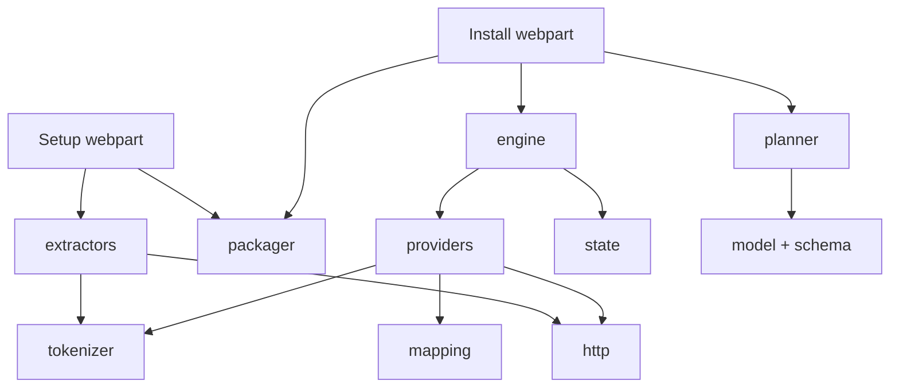

# CopyJet – Fejlesztői leírás

Utolsó frissítés: 2026-09-24 · Szerző: Zoli · Élő változat: https://claude.ai/code/artifact/e7f52ccc-e4b4-4130-a491-89aca162a61c

A leírás a [rendszerterv](01-rendszerterv.md) alapján modulonként rögzíti, mit kell fejleszteni, mire szolgál, és milyen megoldással készül. A megoldás egy SPFx solution két webparttal (Setup, Install) és egy közös, UI-független core réteggel; a logika 90%-a a core-ban van, a webpartok csak felületet adnak.

**Alapelvek**

- **Párban fejlesztünk:** minden artefaktumtípushoz egy *extractor* (kiolvasás) és egy *provider* (létrehozás) tartozik, közös modelltípussal.
- **A sablon csak adat:** hordozható, tenantfüggetlen, tokenizált JSON; nincs benne GUID vagy URL a forrás site-ról.
- **Idempotens telepítés:** minden provider lépés újrafuttatható.
- **Nincs backend:** minden a felhasználó jogával, böngészőből fut.

## 1. Fejlesztői környezet és projektstruktúra

Egyetlen SPFx projekt készül két webparttal; a core egy mappa ugyanabban a projektben, így közös a build és egy `.sppkg` keletkezik.

| Elem | Választás | Megjegyzés |
| --- | --- | --- |
| Keretrendszer | SPFx **1.23.2** | Heft-alapú build (a gulp megszűnt); a hosted workbench 2026. december 1-jén megszűnik → SPFx Debug Toolbar |
| Futtatókörnyezet | Node.js 22 LTS, TypeScript ≤ 5.8 | Az SPFx 1.23 kompatibilitási táblája szerint |
| UI | React 17.0.1 (`--save-exact`) + Fluent UI (az SPFx-szel szállított) | Más React-verzió csendes futásidejű hibát okozhat |
| SharePoint elérés | PnPjs **4.21.0** (`@pnp/sp`, `@pnp/queryable`) | Batch, fluent API, `ClientsidePage`, taxonomy |
| Graph elérés (opcionális) | `@pnp/graph` 4.21.0 | Felhasználó-leképezés ellenőrzése, M365 csoporttagság; `webApiPermissionRequests` (pl. `User.ReadBasic.All`) – tenant-admin jóváhagyás kell |
| Validálás | AJV 8 (`ajv/dist/2020`) + `ajv-formats` + `ajv-errors` | Séma: `schema/copyjet.v1.schema.json` |
| Csomagolás | JSZip | `.zip` írás/olvasás böngészőben |
| Tesztelés | Jest + ts-jest | Core egységtesztek, PnPjs mockkal |
| Minőség | ESLint (SPFx szabálykészlet), Prettier | CI-ban kötelező |
| Scaffold | Yeoman `@microsoft/generator-sharepoint` 1.23.2, vagy az új `@microsoft/spfx-cli` (`spfx create --template webpart-react`) | Mindkettő ugyanazt a projektstruktúrát adja |

**Mappastruktúra**

```
CopyJet/
├─ CLAUDE.md
├─ docs/                       # rendszerterv, fejlesztői leírás, UI-vázlatok
├─ config/                     # package-solution.json (skipFeatureDeployment: false)
├─ schema/
│  ├─ copyjet.v1.schema.json
│  └─ examples/
├─ src/
│  ├─ core/
│  │  ├─ model/                # TypeScript típusok (a sémából generálva + kiegészítések)
│  │  ├─ schema/               # AJV validátor, migrációk
│  │  ├─ http/                 # PnPjs setup, retry, batch helper
│  │  ├─ tokenizer/
│  │  ├─ mapping/              # felhasználó-, term-, ID-leképezés
│  │  ├─ extractors/           # egy fájl artefaktumtípusonként
│  │  ├─ providers/            # extractorok párjai
│  │  ├─ planner/
│  │  ├─ engine/
│  │  ├─ packager/
│  │  ├─ logger/
│  │  └─ state/
│  ├─ shared/components/       # közös React komponensek (napló, folyamatjelző, varázslókeret)
│  └─ webparts/
│     ├─ copyJetSetup/
│     └─ copyJetInstall/
└─ tests/
```

A `core` semmilyen React- vagy SPFx UI-importot nem tartalmazhat; a `WebPartContext`-et csak a `http` modul kapja meg inicializáláskor.

## 2. Modulok áttekintése

A 13 modul három rétegbe rendeződik: alapszolgáltatások, artefaktum-logika és vezérlés, erre épül a két webpart.



Minden modul a `model`-t és a `logger`-t is használja; ezeket az átláthatóság miatt nem rajzoltuk be.

| Modul | Feladat | Megoldás | Fázis |
| --- | --- | --- | --- |
| `model` | Sablon és artefaktumok TypeScript típusai | Interfészek, diszkriminált uniók | 0 |
| `schema` | Sablon validálása, verziómigráció | JSON Schema + AJV, migrációs lánc | 0 |
| `http` | SharePoint-hívások, throttling, batch | PnPjs behaviorok, saját retry | 0 |
| `logger` | Események gyűjtése, UI-értesítés, export | Observable napló, CSV/JSON export | 0 |
| `tokenizer` | Site-függő értékek ↔ tokenek | Regiszterelt tokenfeloldók | 0 |
| `extractors` | Artefaktumok kiolvasása a forrásból | Egy osztály típusonként, közös interfész | 1–3 |
| `providers` | Artefaktumok létrehozása a célon | Egy osztály típusonként, diff + apply | 1–3 |
| `mapping` | Felhasználó-, term- és ID-leképezés | Leképezési táblák, feloldó stratégiák | 2 |
| `planner` | Függőségi gráf, lépéssor | DAG + topologikus rendezés | 1 |
| `engine` | Lépések végrehajtása, szüneteltetés, folytatás | Aszinkron futó, AbortController | 1 |
| `state` | Futásállapot mentése | `CopyJetLog` lista a cél site-on | 4 |
| `packager` | `.json` / `.zip` írás és olvasás | JSZip, blobok fájlonként | 0–2 |
| Webpartok | Setup és Install felület | React, Fluent UI, varázsló | 1–3 |

## 3. Core: model és schema

A `model` a sablon egyetlen igazságforrása TypeScriptben; a `schema` ugyanezt JSON Schemában írja le, és futásidőben validál.

**`model` – fő típusok**

```ts
export interface ITemplate {
  schemaVersion: string;
  meta: ITemplateMeta;
  siteFields: IFieldDef[];
  contentTypes: IContentTypeDef[];
  lists: IListDef[];
  groups: IGroupDef[];
  pages: IPageDef[];
  navigation?: INavigationDef;
  principals: IPrincipalDef[];
  terms?: ITermRef[];
}

export type ArtifactKind =
  | 'group' | 'siteField' | 'contentType' | 'list' | 'listField'
  | 'view' | 'listSecurity' | 'items' | 'files' | 'page' | 'navigation';

export interface IArtifactRef {   // a planner és a napló közös azonosítója
  kind: ArtifactKind;
  key: string;                     // pl. 'list:Projektek', 'field:CJ_Status'
}

export interface IListContentDef {
  mode: 'none' | 'items' | 'files';
  includeVersions: boolean;        // alapértelmezett: false
  source?: string;                 // csomagon belüli útvonal
  sourceMode: 'embedded' | 'reference';
}
```

**`schema` – feladatok és megoldás**

- `validateTemplate(json): IValidationResult` – AJV-vel fordított validátor, hibák emberi nyelvű üzenetekkel (`ajv-errors`).
- Hivatkozási integritás külön lépésben: minden `{listkey:X}`, `fieldRefs`, `principal` kulcs létezik-e a sablonban.
- `migrate(json): ITemplate` – `schemaVersion` alapján láncolt migrációs függvények (`1.0 → 1.1 → …`), így régi sablon is telepíthető.
- A `schemaXml` mezőt engedélyezett attribútumlistával szűrjük (pl. tilos a `Formula` külső hivatkozása, a `SourceID`, a `Version`).

**Sémafájl:** a v1 séma előre elkészült (`schema/copyjet.v1.schema.json`, JSON Schema 2020-12), példafájlokkal (`schema/examples/`). A fő séma a `manifest.json`-t validálja; a csomag többi fájljára a `$defs/itemsFile`, `$defs/filesMetaFile` és `$defs/pageFile` szolgál. A fejlesztés során, amikor az extractorok valós site-okról kérdeznek le, a sémát bővítjük (alverzió + migráció); a TypeScript típusokat a sémából generáljuk (`json-schema-to-typescript`), így a kettő nem térhet el.

**Elkészült, ha:** egy teszt minden mintasablont AJV-vel validál, és a generált típusok fordítása hibamentes.

## 4. Core: http, logger, state

Ez a három modul az infrastruktúra: minden SharePoint-hívás a `http`-n, minden esemény a `logger`-en, minden folytatható állapot a `state`-en megy át.

**`http`**

- `createSp(context, siteUrl?)` – PnPjs `spfi(siteUrl).using(SPFx(context), CopyJetBehavior())`; a forrás és a cél site-hoz külön példány.
- `createGraph(context)` – opcionális, `graphfi().using(GraphSPFx(context))`, csak ha a Graph-funkciók be vannak kapcsolva.
- `CopyJetBehavior` – saját PnPjs behavior: 429/503 esetén `Retry-After` szerinti várakozás, különben exponenciális visszalépés (1, 2, 4, 8, 16 s, max. 5 próba); `User-Agent: NONISV|CopyJet|<verzió>` fejléc.
- `runBatched(ops, size = 100)` – műveletek darabolása PnPjs `batched()` hívásokba, tételenkénti eredménnyel.
- `limitConcurrency(tasks, 4)` – párhuzamos hívások korlátozása (egyszerű szemafor).
- `uploadFile(folder, name, blob)` – 10 MB alatt `addUsingPath`, felette chunked (`addChunked`, 10 MB-os darabok) folyamatjelzéssel.

**`logger`**

- `ILogEntry { time, level: 'info'|'warn'|'error', artifact?: IArtifactRef, step?, message, detail? }`.
- Feliratkozható (`subscribe(cb)`), így a UI élőben mutatja; memóriában gyűjt, végén `toCsv()` / `toJson()`.
- Szintenkénti számlálók az összesítő képernyőhöz.

**`state`**

- `CopyJetLog` lista a cél site-on (rejtett, csak tulajdonosoknak), az első telepítéskor jön létre.
- Egy futás = egy elem: `RunId`, `TemplateName`, `Checksum`, `Status`, `CompletedSteps` (JSON), `IdMaps` (JSON melléklet).
- `saveProgress(runId, step)` minden lépés után; `loadRun(checksum)` újraindításkor felajánlja a folytatást.
- Az ID-leképezések mellékletként kerülnek mentésre, mert méretük meghaladhatja a mezőkorlátot.

## 5. Core: tokenizer és mapping

A `tokenizer` teszi hordozhatóvá a sablont: kiolvasáskor a forrás site-ra jellemző értékeket tokenre cseréli, telepítéskor visszaoldja. A `mapping` azokat az értékeket oldja fel, amelyek tenantonként eltérnek (felhasználók, termek, elem-ID-k).

**`tokenizer`**

- `tokenize(value, ctx): string` – ismert forrás-értékek (site URL, szerver-relatív URL, lista-ID-k és -URL-ek, mező-ID-k, nézet-ID-k, csoport-ID-k) keresése és cseréje; a leghosszabb egyezés nyer.
- `resolve(value, ctx): string` – tokenek feloldása a cél kontextusból; ismeretlen tokennél hibát dob, nem hagyja cseréletlenül.
- `deepTokenize(obj)` / `deepResolve(obj)` – rekurzív bejárás objektumokon (webpart-tulajdonságok, navigáció); GUID-okat kis- és nagybetűs, kapcsos zárójeles és kódolt formában is felismer.
- Bővíthető regiszter: `registerToken('listkey', resolver)`; így egy új provider saját tokent hozhat.
- GUID-oknál csak a csupasz GUID-ot cseréljük, a körülötte lévő `{…}` vagy `%7B…%7D` megmarad: `ID="{guid}"` → `ID="{{fieldid:X}}"` → feloldva újra `ID="{cél-guid}"`. URL-eknél csak szegmenshatáron cserélünk (`/sites/a` ≠ `/sites/ab`); a site címét (`{sitename}`) és a gyökérsite `/` útvonalát nem cseréljük automatikusan.

| Token | Forrás oldalon | Cél oldalon |
| --- | --- | --- |
| `{site}` | Forrás site abszolút URL | Cél site abszolút URL |
| `{siterelative}` | Szerver-relatív URL | Cél szerver-relatív URL |
| `{sitename}` | Site címe | Cél site címe |
| `{listkey:X}` | Lista GUID | Létrehozott lista GUID |
| `{listurl:X}` | Lista URL | Cél lista URL |
| `{fieldid:X}` | Mező GUID | Cél mező GUID |
| `{viewid:X:N}` | Nézet GUID | Cél nézet GUID |
| `{groupid:X}` / `{groupkey:X}` | SP-csoport ID | Cél SP-csoport ID |
| `{principal:key}` | Felhasználó login | Leképezett felhasználó |
| `{associatedownergroup}` / `{associatedmembergroup}` / `{associatedvisitorgroup}` | Alapértelmezett csoportok | Cél alapértelmezett csoportjai |

**`mapping`**

- `PrincipalMapper` – stratégiák sorrendben: azonos e-mail → domaincsere (`@forras.hu` → `@cel.hu`) → feltöltött CSV → helyettesítő felhasználó → üres. Találatnál `web.ensureUser()`, az eredmény gyorsítótárban. Opcionálisan `@pnp/graph` a felhasználó létezésének előzetes ellenőrzésére.
- `TermMapper` – azonos tenantnál GUID szerint; más tenantnál `termcsoport / termkészlet / címke-útvonal` alapján a PnPjs `taxonomy` API-val. Hiány → figyelmeztetés az előnézetben.
- `IdMap` – listánkénti `Map<number, number>` (forrás → cél elem-ID), a lookup-feloldáshoz; a `state` menti.

## 6. Core: extractorok

Minden artefaktumtípusnak egy extractor osztálya van, közös interfésszel; a Setup ezeket hívja a feltérképezéshez (`discover`) és a kiolvasáshoz (`extract`).

```ts
export interface IExtractor<TDef> {
  kind: ArtifactKind;
  discover(sp: SPFI): Promise<IDiscoveredArtifact[]>;          // fanézethez: név, méret, elemszám
  dependencies(def: TDef): IArtifactRef[];                     // mit kell még bevonni
  extract(sp: SPFI, refs: IArtifactRef[], opts: IExtractOptions,
          out: ITemplateWriter): Promise<void>;                  // modellbe és csomagba ír
}
```

| Extractor | Mit olvas | Megoldás / API |
| --- | --- | --- |
| `SiteFieldExtractor` | Egyedi site columnok | `web.fields.filter("CanBeDeleted eq true")`, `SchemaXml` tokenizálva |
| `ContentTypeExtractor` | Egyedi tartalomtípusok, mezőhivatkozások | `web.contentTypes` + `fieldLinks`; szülőlánc az ID prefixből |
| `ListExtractor` | Lista/tár beállítások, lista mezők, tartalomtípusok, mappák | `lists.filter("Hidden eq false")`, `fields`, `rootFolder.folders` rekurzívan |
| `ViewExtractor` | Nézetek | `views` – `ViewQuery`, `ViewFields`, `RowLimit`, `CustomFormatter` |
| `GroupExtractor` | SP-csoportok, szerepkör-hozzárendelések, opcionálisan tagok | `siteGroups`, `roleAssignments`; tagok csak ha `includeMembers` |
| `ListSecurityExtractor` | Egyedi listajogosultság | `HasUniqueRoleAssignments`, `roleAssignments.expand("Member,RoleDefinitionBindings")` |
| `ItemExtractor` | Listaelemek, mellékletek | `RenderListDataAsStream` lapozással (`Paging`), mezőtípus szerinti szerializálás |
| `FileExtractor` | Fájlok, metaadatok, opcionálisan verziók | `getFileByServerRelativePath().getBlob()`, `versions`; blob a packagerbe |
| `PageExtractor` | Modern lapok, SiteAssets képek | `sp.web.loadClientsidePage()`, `CanvasContent1`, `LayoutWebpartsContent`; kép-URL-ek kigyűjtése |
| `NavigationExtractor` | Bal oldali és felső menü | `web.navigation.quicklaunch` / `topNavigationBar`, `children` rekurzívan |

**Szabályok**

- Rendszer- és rejtett listák kizárása egy központi tiltólistával (pl. `appdata`, `TaxonomyHiddenList`, `User Information List`).
- Mezők: csak nem rendszer mezők (`FromBaseType eq false` vagy egyedi `SourceID`).
- A `PageExtractor` a webpart-tulajdonságokat `deepTokenize`-zal dolgozza fel; a nem tokenizálható, forrás-URL-t tartalmazó értékekről figyelmeztetést ír.
- Minden extractor az `ITemplateWriter`-be ír, nem közvetlenül a JSON-ba; nagy adat (elemek, fájlok) a packager külön bejegyzéseibe kerül.

## 7. Core: providerek

A providerek az extractorok párjai: előbb összevetik a sablont a cél site-tal (`diff`, az előnézethez), majd létrehozzák vagy frissítik az artefaktumot (`apply`). Mindkettőnek idempotensnek kell lennie.

```ts
export type DiffStatus = 'new' | 'same' | 'different' | 'unsupported';
export type ConflictMode = 'skip' | 'update' | 'rename';

export interface IProvider<TDef> {
  kind: ArtifactKind;
  diff(sp: SPFI, def: TDef, ctx: IInstallContext): Promise<IDiffResult>;
  apply(sp: SPFI, def: TDef, mode: ConflictMode, ctx: IInstallContext): Promise<IApplyResult>;
  // IApplyResult: létrejött azonosítók → ctx.tokens-be regisztrálva
}
```

| Provider | Létrehozás módja | Kritikus részletek |
| --- | --- | --- |
| `GroupProvider` | `siteGroups.add`, tulajdonos beállítása, `roleAssignments.add` | Tagok csak `includeMembers` esetén, `PrincipalMapper`-rel |
| `SiteFieldProvider` | `fields.createFieldAsXml(resolvedSchemaXml)` | Lookup mezők itt nem; `ID` és `StaticName` megőrzése |
| `ContentTypeProvider` | `contentTypes.add(id, name, ...)` + `fieldLinks` | Szülő előbb; a megőrzött ID biztosítja az öröklést |
| `ListProvider` | `lists.ensure(title, desc, template, ...)`, majd `update` a beállításokra | URL a sablon `url` mezője szerint, a cím utána |
| `ListFieldProvider` | `createFieldAsXml` a listán, lookupok `{listkey}` feloldásával | Második körben fut, amikor minden lista létezik |
| `ViewProvider` | `views.add` / `update`, `ViewFields` csere | Alapértelmezett nézet beállítása |
| `ListSecurityProvider` | `breakRoleInheritance(false)` + `roleAssignments.add` | Csak ha a forrásban egyedi volt |
| `ItemProvider` | `addValidateUpdateItemUsingPath` batch-ben (100) | Mappák előbb; lookupok második körben az `IdMap`-pel; Author/Editor/Created/Modified beállítása |
| `FileProvider` | `http.uploadFile`, majd metaadat-írás | Verzióknál sorrendi feltöltés + `validateUpdateListItem` `bNewDocumentUpdate: true`; hivatkozásos módban `createCopyJobs` |
| `PageProvider` | `ClientsidePage` létrehozás, vászon betöltés `deepResolve` után, `save()` + publikálás | Előtte `GetClientSideWebParts` ellenőrzés; SiteAssets képek feltöltése előbb |
| `NavigationProvider` | `quicklaunch.add` / `topNavigationBar.add`, gyerekekkel | Hozzáfűzés duplikációszűréssel vagy csere; kezdőlap beállítása (`rootFolder.update({WelcomePage})`) |

**Közös szabályok**

- `apply` előtt mindig `diff`: `same` → kihagyás; `different` → a `ConflictMode` dönt; `rename` esetén `_copy` utótag és a token az új névre mutat.
- Egy provider sosem töröl semmit a cél site-on.
- A mezőérték-szerializálás egy közös `FieldValueSerializer`-ben van (mezőtípusonként `toTemplate` / `toTarget`), amelyet az `ItemExtractor` és az `ItemProvider` is használ.

## 8. Core: planner és engine

A `planner` a sablonból függőségi gráfot épít és lépéssort készít; az `engine` ezt a lépéssort hajtja végre, szüneteltethetően és folytathatóan.

**`planner`**

- `buildPlan(template, selection, diffs): IPlan` – csomópontok = `IArtifactRef` + fázis; élek = függőségek (pl. `listField:Projektek.Ugyfel` → `list:Ugyfelek`).
- Kahn-algoritmus a topologikus rendezéshez; ugyanazon szinten lévő lépések párhuzamosíthatók.
- Ciklusok feloldása: a lookup mezők és a lookup értékek külön lépésbe kerülnek (`listField`, `itemsLookupPass`), így a gráf mindig DAG.
- Letiltott tétel esetén a tőle függő tételek is letiltódnak, és a UI ezt jelzi.

| Fázis | Lépéstípusok |
| --- | --- |
| 0 | Leképezés jóváhagyása |
| 1 | `group` |
| 2 | `siteField` |
| 3 | `contentType` |
| 4 | `list` (üres váz) |
| 5 | `listField`, CT-hozzárendelés |
| 6 | `view`, mappák, lista-beállítások |
| 7 | `listSecurity` |
| 8 | `items` (lookup céllisták előbb), `itemsLookupPass` |
| 9 | `files` |
| 10 | `page` |
| 11 | `navigation`, kezdőlap |

**`engine`**

- `run(plan, ctx, { signal, onProgress })` – lépések sorban, szinten belül `limitConcurrency(4)`-gyel.
- Minden lépés: `provider.apply` → tokenek regisztrálása → `state.saveProgress` → `logger`.
- Hiba esetén a lépés `failed`, a függő lépések `blocked`, a függetlenek futnak tovább.
- `AbortController` a leállításhoz; `resume(runId)` a kész lépéseket kihagyja, a tokeneket és `IdMap`-eket a `state`-ből tölti vissza.
- `onProgress` események: `{ stepIndex, total, artifact, status, bytesDone?, bytesTotal? }`.

## 9. Core: packager

A `packager` írja és olvassa a sablonfájlt: csak szerkezetnél egy `manifest.json`, tartalommal egy `.zip`. A többi modul csak az `ITemplateWriter` / `ITemplateReader` interfészt látja, a formátumot nem.

```
sablon.zip
├─ manifest.json
├─ items/<listkey>.json              # elemek, mezőtípus szerint szerializálva
├─ attachments/<listkey>/<itemId>/<fájlnév>
├─ files/<listkey>/<útvonal>        # aktuális verzió
├─ files/<listkey>/<útvonal>/_v/<verzió>   # csak includeVersions esetén
├─ files/<listkey>/_meta.json      # fájl-metaadatok
├─ pages/<lapnév>.json              # vászon, tokenizálva
└─ assets/<útvonal>                 # SiteAssets képek
```

- `TemplateWriter.addJson(path, obj)` / `addBlob(path, blob)` / `finalize(): Promise<Blob>` – JSZip, `compression: 'DEFLATE'` szöveges fájlokra, `STORE` már tömörített formátumokra (docx, pdf, jpg).
- `finalize` során SHA-256 ellenőrzőösszeg számítása (`crypto.subtle.digest`) a `meta.checksum`-ba.
- `TemplateReader.open(file)` – `.json` vagy `.zip` felismerése, manifest validálása, a többi bejegyzés lusta betöltése (`getBlob(path)` csak akkor, amikor a provider kéri).
- Memória: fájlonkénti blobok, nem egyetlen nagy ArrayBuffer; 1 GB feletti becsült méretnél a Setup figyelmeztet.
- Mentés: böngészős letöltés (`URL.createObjectURL`) és/vagy feltöltés a `CopyJetTemplates` tárba a `http.uploadFile`-lal.

## 10. Setup webpart

A Setup egy négylépéses varázsló (Kiválasztás → Opciók → Összesítő → Export); az állapotot egy `useReducer`-alapú store tartja, a logikát a core végzi. UI-vázlat: `docs/ui/`.

| Komponens | Feladat | Megoldás |
| --- | --- | --- |
| `CopyJetSetupWebPart.ts` | Belépési pont, property pane | `http.createSp(context)`, React render; tulajdonságok: sablontár, max. fájlméret, rendszerlisták mutatása |
| `SetupWizard` | Lépések közötti navigáció | Közös `WizardShell` + lépésjelző |
| `ArtifactTree` | Artefaktumfa jelölőnégyzetekkel, „Teljes site” kapcsoló | `GroupedList` / `DetailsList` csoportosítással; adat az extractorok `discover` hívásából, párhuzamosan betöltve |
| `ArtifactOptionsPanel` | Tételenkénti opciók (szerkezet/tartalom, szűrő, verziók, tagok) | Fluent `Panel`; alapértelmezések: tartalom ki, verziók ki, tagok ki |
| `DependencyDialog` | Hiányzó függőségek felajánlása | `extractor.dependencies()` összesítve; „Mind hozzáadása” / egyenként |
| `SummaryStep` | Választott elemek, becsült méret, figyelmeztetések | Elemszám és fájlméret összegzése; személyes adat figyelmeztetés, ha tagok vagy szerzők is másolódnak |
| `ExportStep` | Kiolvasás futtatása, folyamatjelző, letöltés/mentés | `extract` sorban, `ProgressIndicator`, közös `LogViewer` |

```ts
interface ISetupState {
  step: 'select' | 'options' | 'summary' | 'export';
  discovered: IDiscoveredArtifact[];
  selection: Map<string, IArtifactSelection>;   // kulcs: IArtifactRef.key
  globalOptions: { preserveAuthors: boolean; maxFileMb: number; format: 'json' | 'zip' };
  exportStatus?: 'running' | 'done' | 'failed';
}
```

## 11. Install webpart

Az Install ötlépéses varázsló (Betöltés → Leképezés → Előnézet → Telepítés → Eredmény); induláskor ellenőrzi a jogosultságot és a félbemaradt futásokat. UI-vázlat: `docs/ui/`.

| Komponens | Feladat | Megoldás |
| --- | --- | --- |
| `CopyJetInstallWebPart.ts` | Belépési pont, property pane | Jogosultság-ellenőrzés: `web.getCurrentUserEffectivePermissions()` → ManageLists, ManageWeb, ManagePermissions |
| `ResumeBanner` | Félbemaradt futás felajánlása | `state.loadRun()`; „Folytatás” / „Új telepítés” |
| `TemplateLoader` | Sablon feltöltése vagy kiválasztása tárból / URL-ről | Saját drag & drop + PnP `FilePicker` (`@pnp/spfx-controls-react`); `TemplateReader.open` + `schema.validateTemplate` + `migrate` |
| `MappingStep` | Felhasználó- és term-leképezés | Automatikus javaslat a `PrincipalMapper` / `TermMapper` stratégiákkal; szerkeszthető tábla, CSV import; csak ha a forrás tenant eltér vagy hiány van |
| `PreviewStep` | Diff-eredmények, ütközésmód, tételek ki-/bekapcsolása | Minden provider `diff`-je párhuzamosan; `DetailsList` státusz ikonokkal; globális és tételenkénti `ConflictMode`; hiányzó webpartok listája |
| `InstallStep` | Telepítés futtatása | `planner.buildPlan` → `engine.run`; lépés- és bájtalapú folyamatjelző, Leállítás gomb, `beforeunload` figyelmeztetés |
| `ResultStep` | Összesítő és napló | Számlálók (létrejött / kihagyva / hiba), `LogViewer` szűrőkkel, CSV/JSON export, linkek a létrejött listákra és lapokra |

**Közös komponensek (`shared/components`)**

- `LogViewer` – virtualizált lista a `logger` feliratkozásával, szintszűrővel.
- `StepProgress` – lépés- és bájtalapú folyamatjelző, becsült hátralévő idővel.
- `WizardShell` – közös varázslókeret mindkét webparthoz.

## 12. Konvenciók, tesztelés, build és telepítés

**Kódolási konvenciók**

- TypeScript `strict: true`; `any` csak indokolt helyen, `// eslint-disable-next-line` megjegyzéssel.
- Egy artefaktumtípus = egy extractor + egy provider + egy tesztfájl pár, azonos névtővel (`List*`, `Page*`).
- Minden aszinkron core-függvény `AbortSignal`-t fogad.
- UI-szövegek a `loc/` erőforrásfájlokban (`hu-hu.js`, `en-us.js`), kódban nincs beégetett szöveg.
- Git: `main` védett, feature ágak, PR review kötelező; Conventional Commits.

**Tesztelés**

| Szint | Mit | Eszköz |
| --- | --- | --- |
| Egység | `tokenizer`, `planner`, `schema`, `FieldValueSerializer`, `mapping` | Jest, PnPjs mock (saját `MockQueryable`) |
| Szerződés | Extractor → sablon → provider kör: ugyanaz a modell jön vissza | Jest, rögzített REST-válaszok (fixture JSON) |
| Integráció | Valódi forrás- és cél-site, azonos és külön tenant | Debug Toolbar / tesztlap, szkriptelt ellenőrző lista |
| Regresszió | Mintasablonok (`tests/templates/*.zip`) telepítése üres site-ra | Kézi, kiadásonként |

Integrációs tesztesetek: lookup-lánc és ciklus, 6000+ elemű lista, 100 MB-os fájl, verziózott tár, lap lista- és kép-webparttal, magyar ↔ angol nyelvű site, hiányzó felhasználó, megszakított és folytatott telepítés.

**Build és telepítés**

1. `npm ci`, majd `npm run build` (Heft: `heft build`), csomagolás `heft package-solution` → `sharepoint/solution/copyjet.sppkg`.
2. `package-solution.json`: `skipFeatureDeployment: false`, `includeClientSideAssets: true`; `webApiPermissionRequests` csak akkor, ha a `@pnp/graph` funkciókat bekapcsoljuk.
3. A `copyjet.sppkg` feltöltése a tenant vagy a site collection app catalogba (mindkét tenantban, ha tenantok között másolunk).
4. Site-onként: *Webhely tartalma → Új → Alkalmazás* → CopyJet; a Setup webpartot a forrás, az Install-t a cél site egy tulajdonosi lapjára kell tenni.
5. Helyi fejlesztés: `npm start` (Heft serve) és az SPFx Debug Toolbar egy valódi SharePoint lapon; a hosted workbenchre ne építsünk, mert 2026. december 1-jén megszűnik.
6. Verziózás: `package-solution.json` és `schemaVersion` külön; a séma csak visszafelé kompatibilis módon változhat, migrációval. SPFx-frissítéshez: `m365 spfx project upgrade`.

## 13. Fejlesztési sorrend

A fejlesztés a rendszerterv fázisait követi; minden fázis végén működő, bemutatható állapot van.

**0. fázis – Alapok**

- [x] SPFx projekt, két üres webpart, mappastruktúra, ESLint, Jest
- [x] `model` típusok és `schema` v1 + AJV validátor
- [x] `http` (retry behavior, batch, concurrency), `logger`
- [x] `tokenizer` alapok (`{site}`, `{listkey}`, `{fieldid}`)
- [x] `packager` – `.json` írás/olvasás

**1. fázis – Szerkezet (MVP)**

- [ ] Extractor + provider: site column, tartalomtípus, lista/tár, lista mező, nézet, SP-csoport
- [ ] `planner` és `engine` (folytatás nélkül)
- [ ] Setup: `ArtifactTree`, `ArtifactOptionsPanel`, `DependencyDialog`, export
- [ ] Install: `TemplateLoader`, `PreviewStep`, `InstallStep`, `ResultStep`

**2. fázis – Tartalom**

- [ ] `FieldValueSerializer` minden támogatott mezőtípusra
- [ ] `ItemExtractor` / `ItemProvider`, mellékletek, `IdMap`, lookup második kör
- [ ] `FileExtractor` / `FileProvider`, chunked upload, opcionális verziók
- [ ] `packager` – `.zip`, checksum
- [ ] `mapping`: `PrincipalMapper`, `TermMapper`, Install `MappingStep`

**3. fázis – Lapok és navigáció**

- [ ] `PageExtractor` / `PageProvider`, SiteAssets, `deepTokenize` / `deepResolve`
- [ ] Webpart-elérhetőség ellenőrzése (`GetClientSideWebParts`)
- [ ] `NavigationExtractor` / `NavigationProvider`, kezdőlap

**4. fázis – Robusztusság**

- [ ] `state` (`CopyJetLog`), `resume`, `ResumeBanner`
- [ ] `ListSecurityExtractor` / `ListSecurityProvider`
- [ ] Hivatkozásos fájlmásolás azonos tenanton (`createCopyJobs`)
- [ ] Integrációs és regressziós tesztkészlet, felhasználói leírás

**5. fázis – Bővítések (később)**

- [ ] Cél site létrehozása az Install-ból
- [ ] Hub-navigáció, további listatípusok
